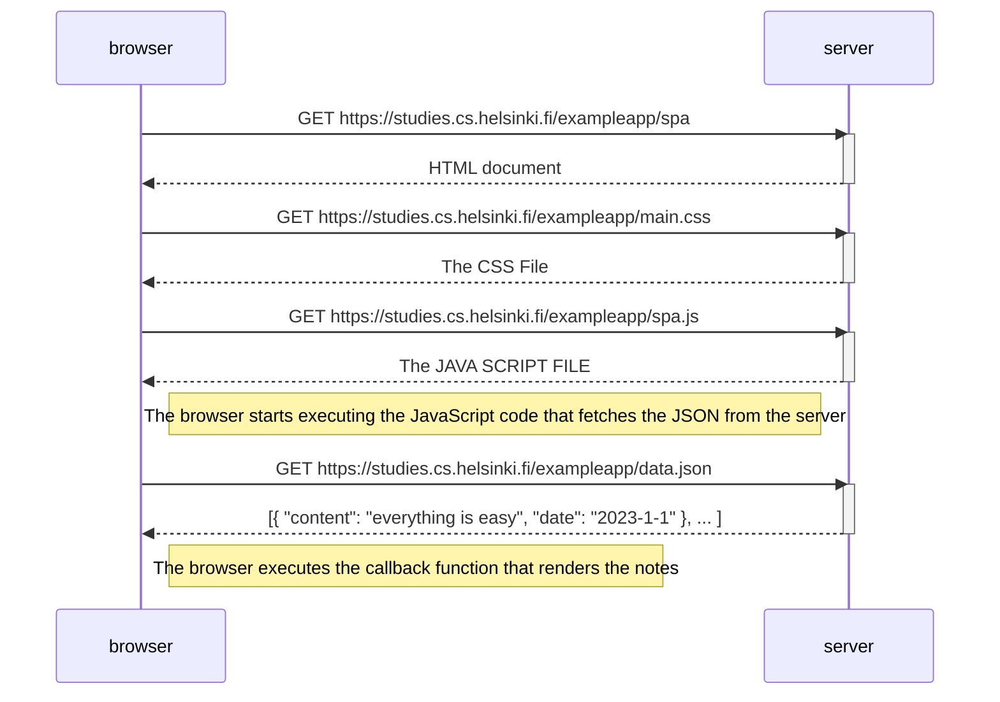

```mermaid
sequenceDiagram
    participant browser
    participant server
    browser->>server: GET https://studies.cs.helsinki.fi/exampleapp/spa
    activate server
    server-->>browser: HTML document
    deactivate server
     browser->>server: GET https://studies.cs.helsinki.fi/exampleapp/main.css
    activate server
    server-->>browser: The CSS File
    deactivate server
    browser->>server: GET https://studies.cs.helsinki.fi/exampleapp/spa.js
    activate server
    server-->>browser: The JAVA SCRIPT FILE
    deactivate server
   
    Note right of browser: The browser starts executing the JavaScript code that fetches the JSON from the server
    browser->>server: GET https://studies.cs.helsinki.fi/exampleapp/data.json
    activate server
    server-->>browser: [{ "content": "everything is easy", "date": "2023-1-1" }, ... ]
    deactivate server
    Note right of browser: The browser executes the callback function that renders the notes
```